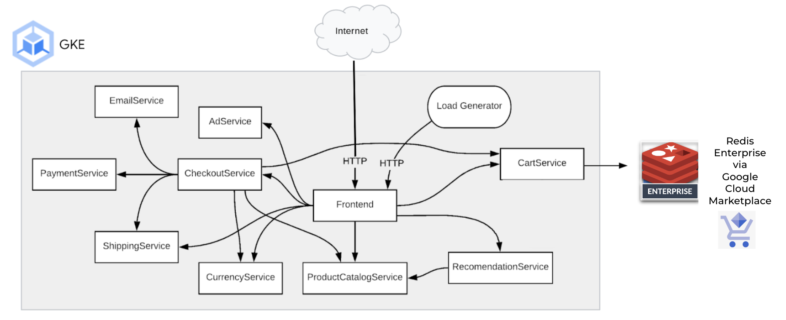

# Scaling Microservices Applications: Migration to Redis Enterprise on Google Cloud
  
This demo repo shows you how to deploy a fully functioning microservices application on Google Cloud using Open Source Redis and migrate the data to Redis Enterprise with minimal downtime. 



## Prerequisites 
### Software to Install
`Only Linux has been tested`
* [gcloud command line](https://cloud.google.com/sdk/docs/install)
* [terraform](https://www.terraform.io/downloads)
* [kubectl](https://kubernetes.io/docs/tasks/tools/)
* [git](https://git-scm.com/book/en/v2/Getting-Started-Installing-Git)

### Accounts Needed
* [Google Cloud Account](https://console.cloud.google.com/)
* [Redis Enterprise in Google Marketplace Account](https://console.cloud.google.com/marketplace/product/redis-marketplace-isaas/redis-enterprise-cloud-flexible-plan)
### Information to Gather
#### Redis Enterprise in Google Cloud Marketplace
* [REDISCLOUD_ACCESS_KEY](https://docs.redis.com/latest/rc/api/get-started/enable-the-api/)
* [REDISCLOUD_SECRET_KEY](https://docs.redis.com/latest/rc/api/get-started/manage-api-keys/#secret)
#### Google Cloud
* Project ID
* Region
  
    
## Deployment
### Clone the Repo
```bash
git clone https://github.com/Redislabs-Solution-Architects/gcp-microservices-demo.git
pushd gcp-microservices-demo
```
### Create your own terraform.tfvars
The following values will need to be modified by you.
```bash
cat <<EOF >terraform.tfvars
gcp_project_id = "my_project"
domain_name = "demo.gcp-redis.com"
email_address = "john.doe@ob.com"
redis_access_key = "********"
redis_secret_key = "********"
cluster_name = "online-boutique"
EOF
```  
### Initialize Terraform
```bash
terraform init
```
### Deploy the stack
```bash
terraform apply --auto-approve
```
### What success looks like  
```bash
Apply complete! Resources: 12 added, 0 changed, 0 destroyed.

Outputs:

db_password = <sensitive>
db_private_endpoint = "redis-10402.internal.c22052.us-central1-1.gcp.cloud.rlrcp.com:10402"
gke_cluster_name = "gke-glau-online-boutique"
region = "us-central1"
website = "https://demo2.gcp-redis.com"
```

### Store Redis Enterprise database information in environment variables for later use
```bash
export REDIS_DEST=`terraform output db_private_endpoint | tr -d '"'`
export REDIS_DEST_PASS=`terraform output db_password | tr -d '"'`
```
       
### Target your environment to the GKE cluster
```bash
gcloud container clusters get-credentials \
$(terraform output -raw gke_cluster_name) \
--region $(terraform output -raw region)
```
  
   
## Run the demo
Access the web frontend in a browser using the "doamin name" defined in your terraform.tfvars file. The web application is using the inbuilt  OSS Redis container as the backing store for the shopping cart.

### Clone the microserivces demo repo
```bash
popd
git clone https://github.com/gmflau/microservices-demo.git
pushd microservices-demo/kustomize
```
  
### Migrate the shopping cart data from OSS Redis to Redis Enterpirse in Google Cloud Marketplace
Create a K8 secret for Redis Enterprise database connection
```bash
kubectl apply -f - <<EOF
apiVersion: v1
kind: Secret
metadata:
  name: redis-creds
type: Opaque
stringData:
  REDIS_SOURCE: redis://redis-cart:6379
  REDIS_DEST: redis://${REDIS_DEST}
  REDIS_DEST_PASS: ${REDIS_DEST_PASS}
EOF
```   
Run a K8 job to migrate data from OSS Redis to Redis Enterprise database
```bash
kubectl apply -f https://raw.githubusercontent.com/Redislabs-Solution-Architects/gcp-microservices-demo/main/util/redis-migrator-job.yaml
```

### Delete local redis-cart based on OSS Redis
```bash
kubectl delete deploy redis-cart
```
 
### Configure the shopping cart with Redis Enterprise database via Kustomize
```bash
kustomize edit add component components/redis-enterprise
```
  
This will update the kustomize/kustomization.yaml file which could be similar to:
```
apiVersion: kustomize.config.k8s.io/v1beta1
kind: Kustomization
resources:
- base
components:
- components/redis-enterprise
```

Update current Kustomize manifest to target this fully managed Redis Enterprise database instance Construct the connection string for the fully managed Redis Enterprise database instance:
```bash
export REDIS_IP="${REDIS_DEST},user=default,password=${REDIS_DEST_PASS}"
```  
Update components/redis-enterprise/kustomization.yaml with the Redis Enterprise database's connection string:
```bash
sed -i "s/REDIS_CONNECTION_STRING/${REDIS_IP}/g" components/redis-enterprise/kustomization.yaml
```

Render to review the deployment manifest by running:
```bash
kubectl kustomize .
```
  
Deploy to make the Redis Enterprise database as the backend store for the shopping cart:
```bash
kubectl apply -k .
```

<!-- BEGIN_TF_DOCS -->
## Inputs

| Name | Description | Type | Default | Required |
|------|-------------|------|---------|:--------:|
| <a name="input_gcp_project_id"></a> [gcp\_project\_id](#input\_gcp\_project\_id) | The project ID to deploy the cluter into | `string` | n/a | yes |
| <a name="input_domain_name"></a> [domain\_name](#input\_domain\_name) | The domain name to use for DNS records | `string` | n/a | yes |
| <a name="input_email_address"></a> [email\_address](#input\_email\_address) | The email address to use with Cert Manager | `string` | n/a | yes |
| <a name="input_redis_secret_key"></a> [redis\_secret\_key](#input\_redis\_secret\_key) | The secret key for accessing Redis Enterprise Cloud API | `string` | n/a | yes |
| <a name="input_redis_access_key"></a> [redis\_access\_key](#input\_redis\_access\_key) | The access key for accessing Redis Enterprise Cloud API | `string` | n/a | yes |
| <a name="input_cluster_name"></a> [cluster\_name](#input\_cluster\_name) | The name of the GKE cluster | `string` | `"boutique"` | no |
| <a name="input_gcp_region"></a> [gcp\_region](#input\_gcp\_region) | The region to deploy the cluster in | `string` | `"us-central1"` | no |
| <a name="input_gke_node_count"></a> [gke\_node\_count](#input\_gke\_node\_count) | The number of nodes to deploy in the cluster | `number` | `1` | no |
| <a name="input_gke_release_channel"></a> [gke\_release\_channel](#input\_gke\_release\_channel) | The gke release channel to deploy | `string` | `"RAPID"` | no |
| <a name="input_gke_machine_type"></a> [gke\_machine\_type](#input\_gke\_machine\_type) | The type of machine to deploy | `string` | `"c2-standard-4"` | no |
| <a name="input_redis_subscription_cidr"></a> [redis\_subscription\_cidr](#input\_redis\_subscription\_cidr) | The name of the Redis Enterprise Cloud Subscription deployment's CIDR | `string` | `"192.168.0.0/24"` | no |
| <a name="input_cert_manager_version"></a> [cert\_manager\_version](#input\_cert\_manager\_version) | The version of cert manager to install | `string` | `"v1.10.0"` | no |
| <a name="input_redis_db_type"></a> [redis\_db\_type](#input\_redis\_db\_type) | The type of Redis DB to be setup by default. Valid options are 'OSS' or 'Ent' | `string` | `"OSS"` | no |

## Outputs

| Name | Description |
|------|-------------|
| <a name="output_gke_cluster_name"></a> [gke\_cluster\_name](#output\_gke\_cluster\_name) | The name of the GKE cluster |
| <a name="output_region"></a> [region](#output\_region) | The Region the GKE cluster is deployed |
| <a name="output_db_private_endpoint"></a> [db\_private\_endpoint](#output\_db\_private\_endpoint) | The Redis DB endpoint |
| <a name="output_db_password"></a> [db\_password](#output\_db\_password) | The Redis DB Password |
| <a name="output_website"></a> [website](#output\_website) | The domain the website will be hosted on. |
<!-- END_TF_DOCS -->
